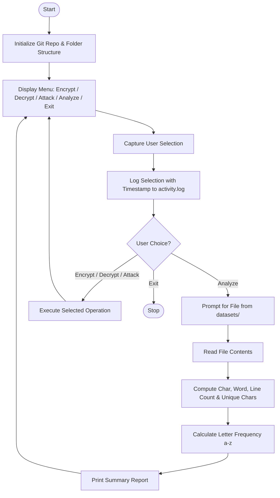

# Lab 1 — Project Foundation & File Analysis

## Aim
To set up a modular cryptographic project foundation using Git version control, implement an interactive menu-driven CLI, build a text file statistical analysis module, and integrate an activity logging system.

## Brief Theory
Cryptographic applications require systematic foundations for processing plaintexts, ciphertexts, and audit trails.
File statistical analysis provides essential metrics such as character count, word count, line count, and unique characters.
Letter frequency analysis (tracking distribution of letters 'a' through 'z') serves as a fundamental cryptanalytic technique to attack classical substitution ciphers by exploiting language redundancy.
Modular software design decouples CLI presentation, statistical processing, and data persistence for maintainability.
Activity logging with timestamps guarantees traceability and reproducibility across all operational workflows.

## Algorithm/Flowchart



**Steps:**
1. Initialize Git repository and create folder hierarchy (`datasets/`, `logs/`, source modules).
2. Display interactive menu: Encrypt, Decrypt, Attack, Analyze, Exit.
3. Capture user selection and log with timestamp to `logs/activity.log`.
4. If Analyze → prompt for file from `datasets/`, read contents, compute stats (chars, words, lines, unique chars), calculate letter frequency (a–z), print report.
5. Loop back to menu until Exit.

## Important Commands
```bash
git init
git clone <repository_url>
pip install -r requirements.txt
python main.py
git add .
git commit -m "Initial commit: project foundation and file analysis"
git push origin main
```

## Observations
- The menu-driven CLI successfully routes between cryptographic and analysis options.
- The file analysis module accurately calculates document metrics and letter frequencies across test datasets.
- The activity logging system records every menu choice with accurate timestamps in `logs/activity.log`.
