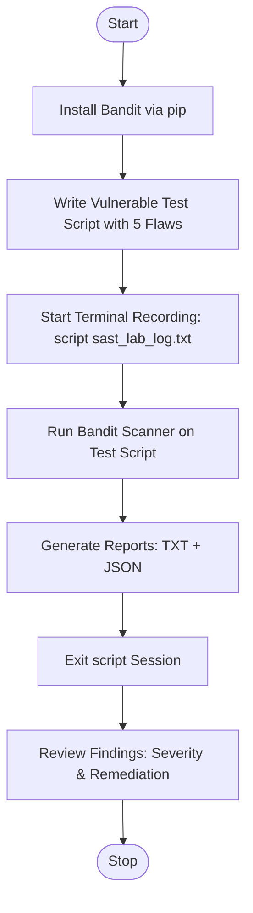

# Lab 2 — Static Application Security Testing (SAST) using Bandit

## Aim
To install Bandit SAST tool, create a deliberately vulnerable Python program, scan for vulnerabilities, and capture terminal logs.

## Brief Theory
SAST analyzes source code without execution to find security flaws early in development. Bandit is a Python security linter that builds an AST and evaluates code against vulnerability plugins. It detects issues like hardcoded credentials (B105), weak hashing (B303), command injection (B602), and reports them by severity (Low/Medium/High).

## Algorithm/Flowchart



**Steps:**
1. Install Bandit using `pip install bandit`.
2. Write a vulnerable Python script embedding 5 flaws (B101, B105, B303, B311, B602).
3. Start terminal recording with `script sast_lab_log.txt`.
4. Run Bandit scanner in recursive mode on the test script.
5. Export reports in TXT and JSON formats.
6. Exit recording session and review findings (severity, remediation).

## Important Commands
```bash
pip install bandit
bandit -r tests/vulnerable_test.py
bandit -r file.py -f txt -o report.txt
bandit -r file.py -f json -o report.json
script sast_lab_log.txt
exit
cat sast_lab_log.txt
```

## Observations

**Environment:** Ubuntu 20.04.6 LTS, Python 3.8.10, Bandit v1.7.10
**Target:** `tests/vulnerable_test.py` (21 LOC) | **Total Issues: 7** (High: 1, Medium: 1, Low: 5)

| Issue ID | Vulnerability | Severity | Confidence | CWE | Line | Description |
|----------|--------------|----------|------------|-----|------|-------------|
| B404 | `import subprocess` | Low | High | CWE-78 | 3 | Security implications of subprocess module |
| B105 | Hardcoded API key | Low | Medium | CWE-259 | 7 | `SECRET_API_KEY = "sk_live_..."` |
| B105 | Hardcoded password | Low | Medium | CWE-259 | 8 | `ADMIN_PASSWORD = "SuperSecret..."` |
| B101 | `assert` for auth | Low | High | CWE-703 | 12 | Stripped in optimized bytecode (`-O`) |
| B303 | Weak hash (MD5) | Medium | High | CWE-327 | 17 | `hashlib.md5()` — insecure for cryptography |
| B602 | Shell injection | **High** | High | CWE-78 | 22 | `subprocess.Popen(cmd, shell=True)` |
| B311 | Insecure random | Low | High | CWE-330 | 26 | `random.randint()` used for security tokens |

- All 5 intentionally embedded vulnerabilities were detected.
- Terminal session captured using `script sast_lab_log.txt`; reports exported in TXT and JSON formats.
