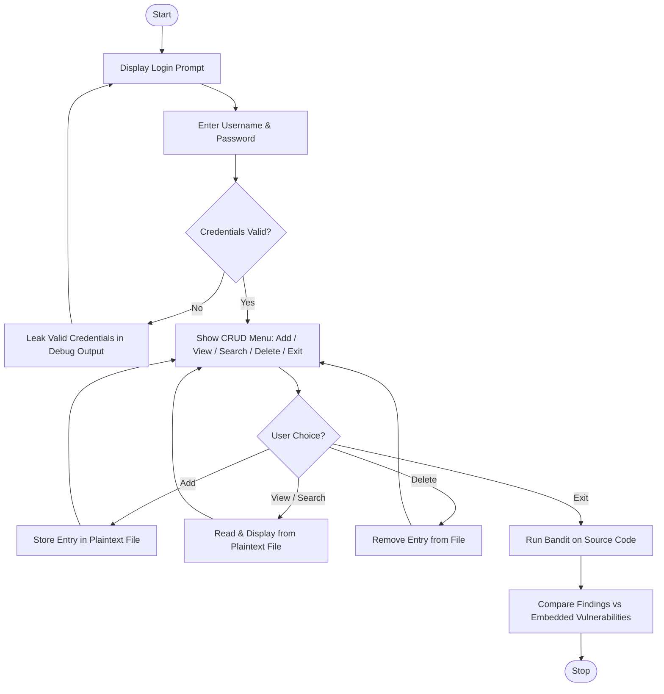

# Lab 3 — Secure Application Development (Password Manager)

## Aim
To develop a console-based Password Manager with 3 intentional vulnerabilities and evaluate Bandit's detection capabilities.

## Brief Theory
Secure applications require proper authentication, sanitized outputs, and encrypted storage. Static analysis tools like Bandit detect pattern-based flaws (e.g., hardcoded credentials) but cannot detect logic-level flaws (information leakage, plaintext storage), highlighting the need for manual code review alongside SAST.

## Algorithm/Flowchart



**Steps:**
1. Launch Password Manager CLI → display login prompt.
2. Verify credentials against hardcoded admin username/password.
3. On failure → leak valid credentials in debug output (intentional vulnerability).
4. On success → present CRUD menu: Add, View, Search, Delete, Exit.
5. All entries stored/retrieved in plaintext (intentional vulnerability).
6. Run Bandit on source → compare detected vs embedded vulnerabilities to identify SAST blind spots.

## Important Commands
```bash
python password_manager.py
bandit -r secure_application/src/password_manager.py
bandit -r file.py -f txt -o report.txt
```

## Observations

**Application:** Password Manager (Group 9) | **Code:** 107 LOC | **Default Creds:** `admin / admin123`

### Vulnerability Detection Results

| Vulnerability | Mechanism | Bandit Detected? | Why / Why Not |
|--------------|-----------|:---:|---------------|
| Hardcoded Credentials | `ADMIN_PASSWORD = "admin123"` (Line 4–5) | ✅ Yes (B105) | Pattern match on variable name containing `PASSWORD` |
| Information Leakage | Failed login prints valid credentials in debug output | ❌ No | Logic-level flaw; Bandit can't distinguish sensitive vs normal `print` |
| Insecure Storage | Passwords saved in plaintext (`passwords.txt`) | ❌ No | Architectural flaw; `file.write()` is standard Python syntax |

**Result:** Bandit detected **1 out of 3** vulnerabilities — proves SAST alone is insufficient; manual review is essential.

