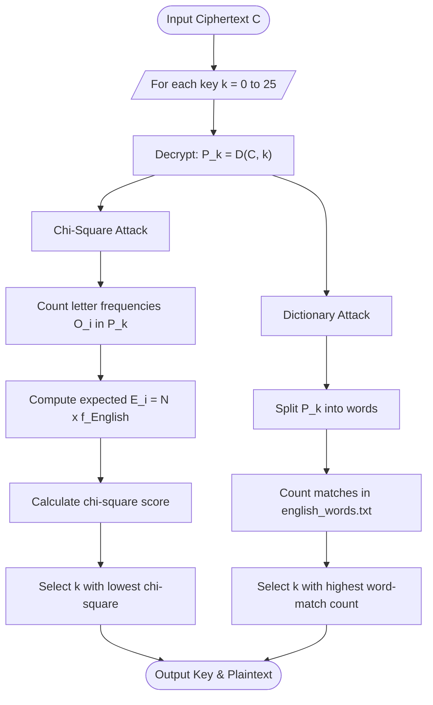

# Lab 4 — Cryptanalysis of Shift (Caesar) Cipher

## Aim
To implement and evaluate two cryptanalysis methods (Chi-Square Statistical Analysis and Brute Force with Dictionary Scoring) on the Shift Cipher in Python.

## Brief Theory
The Shift (Caesar) Cipher encrypts letters via $E(x) = (x + k) \pmod{26}$ and decrypts via $D(y) = (y - k) \pmod{26}$ for key $k \in [0, 25]$.
Because the key space is restricted to only 26 possible values, exhaustive search is trivial.
Chi-square analysis measures the statistical discrepancy between candidate decryption letter frequencies and standard English frequencies:
$$\chi^2 = \sum_{i=0}^{25} \frac{(O_i - E_i)^2}{E_i}$$
The key yielding the minimum $\chi^2$ value corresponds to the most statistically probable English plaintext.
Brute-force with dictionary scoring decrypts the ciphertext under all 26 keys and counts matching valid words against an English word list.
The candidate key maximizing the recognized word count is identified as the correct encryption key.

## Algorithm/Flowchart



**Steps:**
1. Input ciphertext C.
2. **Chi-Square Attack:** For each k ∈ [0, 25] → decrypt → count letter frequencies → compute χ² against English frequencies → select k with lowest χ².
3. **Dictionary Attack:** For each k ∈ [0, 25] → decrypt → split into words → count dictionary matches → select k with highest count.
4. Output predicted keys and decrypted plaintexts.

## Important Commands
```bash
# Navigate to attack directory
cd attacks/shift_cipher_attack

# Run single test or batch mode
python main.py
```

## Observations
- Both attack methods correctly recover the shift key for typical English ciphertexts.
- Chi-square statistical attack is computationally fast and reliable for texts with $\ge 20$ letters, but can misidentify keys on short texts due to statistical noise.
- Dictionary scoring works robustly even on short ciphertexts provided the plaintext contains recognizable words in the dictionary.
