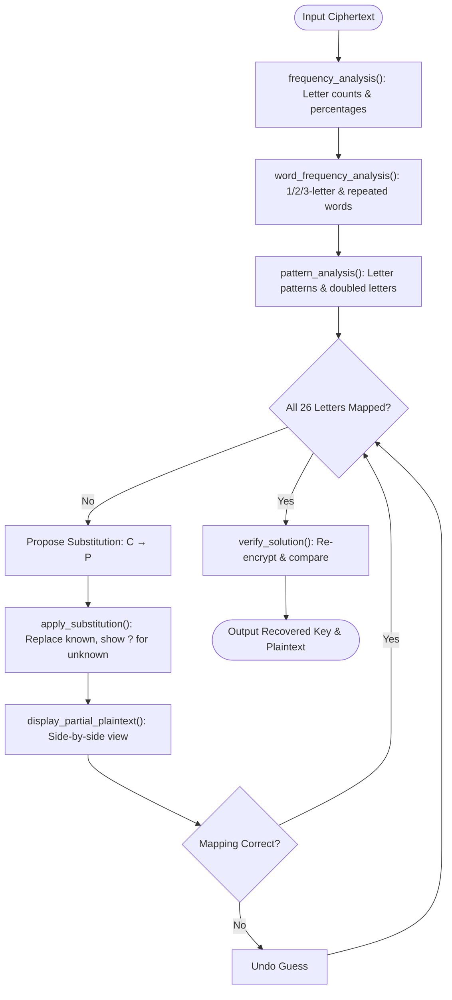

# Lab 5 — Monoalphabetic Substitution Cipher Cryptanalysis

## Aim
To implement and cryptanalyze the Monoalphabetic Substitution Cipher using frequency and pattern analysis in C++.

## Brief Theory
A Monoalphabetic Substitution Cipher maps each letter to a fixed substitute using a permutation of the alphabet. Key space is $26! \approx 4 \times 10^{26}$, making brute-force infeasible. However, letter frequency distributions are preserved, so cryptanalysis uses single-letter frequencies, common word patterns (A, OF, THE), and repeated structures to iteratively recover the key.

## Algorithm/Flowchart



**Steps:**
1. Read ciphertext → run `frequency_analysis()`, `word_frequency_analysis()`, `pattern_analysis()`.
2. Interactive loop: propose substitution (C→P) → `apply_substitution()` → `display_partial_plaintext()`.
3. If wrong → undo guess. If correct → continue until all 26 letters mapped.
4. `verify_solution()`: re-encrypt recovered plaintext, confirm exact match with original ciphertext.

## Important Commands
```bash
# Compile cryptanalysis program
g++ -std=c++17 -Wall -Wextra -Wpedantic main.cpp cipher.cpp analysis.cpp utils.cpp substitution.cpp -o substitution_cipher

# Execute interactive attack
./substitution_cipher
```

## Observations

**Plaintext Source:** Katz & Lindell, p. 39 | **Dataset:** 2,202 alphabetic letters | **Key Space:** 26!

### Top Letter Frequencies (Ciphertext)

| Rank | Cipher Letter | Count | % | Mapped to (Plain) | English Expected % |
|:---:|:---:|:---:|:---:|:---:|:---:|
| 1 | T | 317 | 14.40% | E | 12.70% |
| 2 | Z | 216 | 9.81% | T | 9.06% |
| 3 | Q | 166 | 7.54% | A | 8.17% |
| 4 | O | 157 | 7.13% | I | 6.97% |
| 5 | L | 149 | 6.77% | S | 6.33% |

### Cryptanalytic Decision Table

| Step | Observation | Substitution Tested | Result | Decision |
|:---:|------------|:---:|--------|----------|
| 1 | T is most frequent (14.4%) | T → E | Many matches | ✅ Good |
| 2 | ZIT is top trigram (27×) | Z → T, I → H | Forms "THE" | ✅ Good |
| 3 | Q occurs 25× as single-letter word | Q → A | Forms "A" everywhere | ✅ Good |
| 4 | QFR occurs 10× → "A _ _" | F → N, R → D | Forms "AND" | ✅ Good |
| 5 | OL occurs 10× | O → I, L → S | Forms "IS", "IT" | ✅ Good |
| 6 | GFT pattern, GY pattern | G → O | Forms "ONE", "OF" | ✅ Good |
| 7 | YGK → "_ O _" | Y → F, K → R | Forms "FOR" | ✅ Good |
| 8 | VIOEI pattern | V → W, E → C | Forms "WHICH" | ✅ Good |
| 9 | Section title pattern | H → P, N → Y, S → L | "PERFECTLY SECRET ENCRYPTION" | ✅ Good |
| 10 | DTLLQUT pattern | D → M, U → G | Forms "MESSAGE" | ✅ Good |
| 11 | WT → "_ E" | W → B | Forms "BE" | ✅ Good |
| 12 | XFOYGKD pattern | X → U | Forms "UNIFORM" | ✅ Good |
| 13 | COUTFTKT pattern | C → V | Forms "VIGENERE" | ✅ Good |
| 14 | Remaining letters | A → K, M → Z, B → X | Resolves "KEY", "EXERCISE" | ✅ Good |

### Verification
- **Original Key:** `QWERTYUIOPASDFGHJKLZXCVBNM`
- **Recovered Key:** `QWERTYUIOPASDFGHJKLZXCVBNM`
- **`verify_solution()`:** Re-encryption matches original ciphertext — **100% exact match**.
