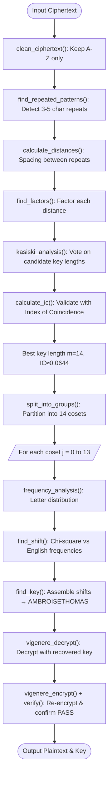

# Lab 6 — Cryptanalysis of Vigenère Cipher

## Aim
To implement cryptanalysis of the polyalphabetic Vigenère Cipher using Kasiski Examination, Index of Coincidence (IC), and Chi-Square frequency analysis in C++.

## Brief Theory
The Vigenère Cipher shifts plaintext letters cyclically by key $K$ of length $m$: $C_i = (P_i + K_{i \pmod m}) \pmod{26}$.
Repeated plaintext segments separated by distances that are multiples of key length $m$ produce identical ciphertext segments.
Kasiski Examination finds repeated 3–5 character substrings, calculates spacing distances, and factors them to tally votes for probable key length $m$.
The Index of Coincidence (IC) calculates the probability that two randomly selected letters are identical:
$$IC = \frac{\sum_{i=0}^{25} f_i(f_i - 1)}{N(N - 1)}$$
English text has $IC \approx 0.0667$ while random text has $IC \approx 0.0385$. Group IC averages confirm the correct key length ($m = 14$, $IC \approx 0.0644$).
Partitioning ciphertext into $m$ independent cosets reduces the polyalphabetic cipher into $m$ monoalphabetic Caesar ciphers, solvable via chi-square goodness-of-fit against standard English frequencies.

## Algorithm/Flowchart



**Steps:**
1. `clean_ciphertext()` → keep only uppercase A–Z.
2. **Kasiski Examination:** `find_repeated_patterns()` → `calculate_distances()` → `find_factors()` → `kasiski_analysis()` to rank candidate key lengths.
3. `calculate_ic()` validates best key length (m=14, IC ≈ 0.0644).
4. `split_into_groups()` → partition into 14 cosets → for each: `frequency_analysis()` + `find_shift()` (chi-square).
5. `find_key()` assembles shifts → **AMBROISETHOMAS**.
6. `vigenere_decrypt()` → decrypt. `vigenere_encrypt()` + `verify()` → confirm PASS.

## Important Commands
```bash
# Compile cryptanalysis modules
g++ -std=c++17 -Wall -Wextra -Wpedantic main.cpp kasiski.cpp frequency.cpp vigenere.cpp -o vigenere

# Execute attack on input ciphertext
./vigenere
```

## Observations
- Kasiski examination correctly isolated candidate factors, and Index of Coincidence confirmed the optimal key length of 14 ($IC \approx 0.0644$).
- Splitting the polyalphabetic ciphertext into 14 cosets effectively transformed it into 14 independent Caesar ciphers.
- Chi-square analysis accurately resolved each shift, recovering key `AMBROISETHOMAS`.
- Decrypted text yielded coherent English, and verification confirmed `PASS` with an exact re-encryption match.
