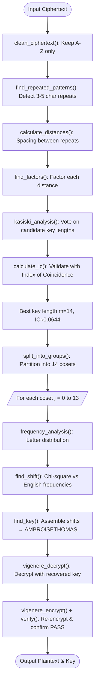

# Lab 6 — Cryptanalysis of Vigenère Cipher

## Aim
To cryptanalyze the Vigenère Cipher using Kasiski Examination, Index of Coincidence, and Chi-Square frequency analysis in C++.

## Brief Theory
The Vigenère Cipher shifts each letter cyclically using a key of length $m$: $C_i = (P_i + K_{i \bmod m}) \bmod 26$. Kasiski Examination finds repeated patterns and factors their distances to estimate $m$. The Index of Coincidence ($IC \approx 0.0667$ for English, $\approx 0.0385$ for random) validates the key length. The ciphertext is split into $m$ cosets, each attacked as an independent Caesar cipher using chi-square analysis.

## Algorithm/Flowchart



**Steps:**
1. `clean_ciphertext()` → keep only uppercase A–Z.
2. **Kasiski Examination:** `find_repeated_patterns()` → `calculate_distances()` → `find_factors()` → `kasiski_analysis()` to rank candidate key lengths.
3. `calculate_ic()` validates best key length (m=14, IC ≈ 0.0644).
4. `split_into_groups()` → partition into 14 cosets → for each: `frequency_analysis()` + `find_shift()` (chi-square).
5. `find_key()` assembles shifts → **AMBROISETHOMAS**.
6. `vigenere_decrypt()` → decrypt. `vigenere_encrypt()` + `verify()` → confirm PASS.

## Important Commands
```bash
# Compile cryptanalysis modules
g++ -std=c++17 -Wall -Wextra -Wpedantic main.cpp kasiski.cpp frequency.cpp vigenere.cpp -o vigenere

# Execute attack on input ciphertext
./vigenere
```

## Observations

### Cryptanalysis Results

| Parameter | Value |
|-----------|-------|
| Ciphertext Length | 395 letters (cleaned, A–Z only) |
| Estimated Key Length | 14 (via Kasiski factor votes + IC validation) |
| Average IC at m=14 | 0.0644 (close to English IC of 0.0667) |
| Recovered Key | `AMBROISETHOMAS` |
| Verification | **PASS** (re-encryption matches original ciphertext exactly) |

### Key Recovery (Per-Coset Shifts)

| Coset | 0 | 1 | 2 | 3 | 4 | 5 | 6 | 7 | 8 | 9 | 10 | 11 | 12 | 13 |
|-------|---|---|---|---|---|---|---|---|---|---|----|----|----|----|
| Shift | 0 | 12 | 1 | 17 | 14 | 8 | 18 | 4 | 19 | 7 | 14 | 12 | 0 | 18 |
| Letter | A | M | B | R | O | I | S | E | T | H | O | M | A | S |

### Recovered Plaintext (Header)
> *"Do you know the land where the orange tree blossoms, the country of golden fruits and marvelous roses..."*

### Functions Display Output

| Required Output | Status |
|----------------|--------|
| Estimated key length | ✅ Displayed (14) |
| Frequency table for each group | ✅ Displayed (14 groups × 26 letters) |
| Recovered key | ✅ Displayed (`AMBROISETHOMAS`) |
| Recovered plaintext | ✅ Displayed (readable English) |
| Re-encryption verification | ✅ PASS |
